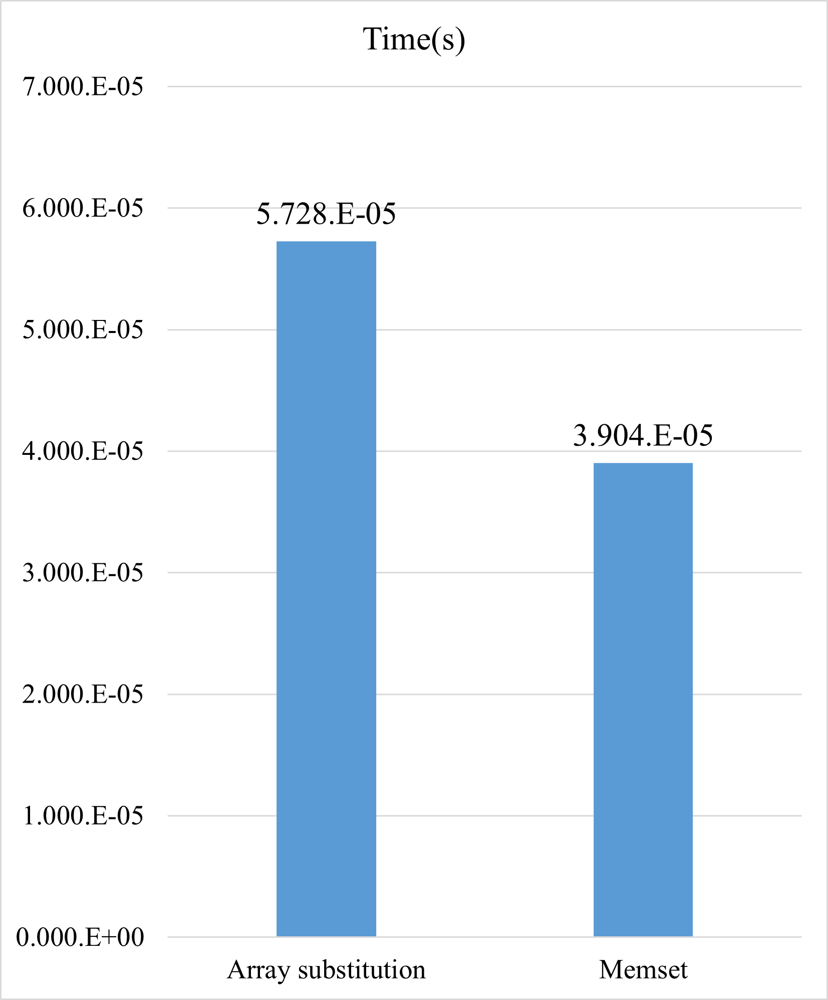

# fortran_memset
A demostration of calling c memset and memcpy in fortran
# Performance Test
Testing on A64FX platform using fujitsu profiler  
Array size 512 KB  
memset is about 1.5 times faster than array substitution
